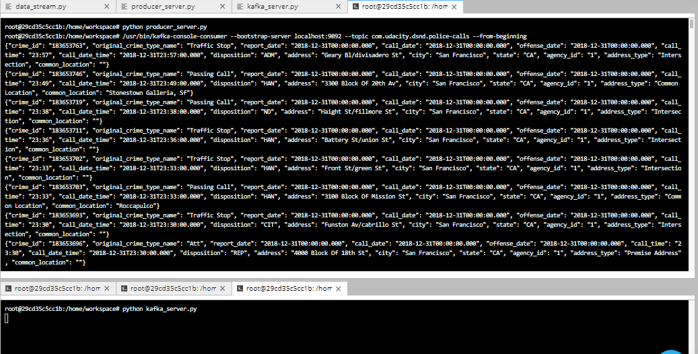
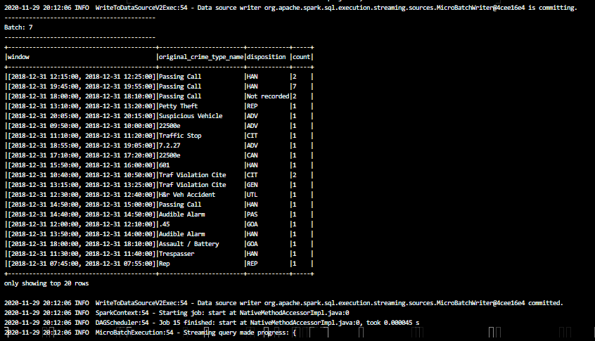
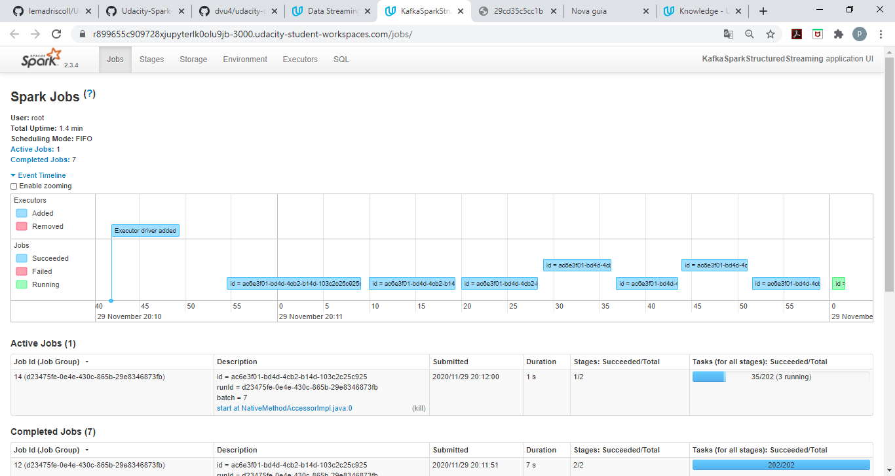

# SF Crime Statistics with Spark Streaming

## Objective
In this project, using a real-world dataset, extracted from Kaggle, on San Francisco crime incidents, and statistical analyses of the data will be made using Apache Spark Structured Streaming. 

## Running and Testing
**Starting Zookeeper and Kafka server.**

* /usr/bin/zookeeper-server-start config/zookeeper.properties
* /usr/bin/kafka-server-start config/server.properties`

**Start producer_server.py and kafka_server.py:**

* python producer_server.py   
* python kafka_server.py

**Kafka console consumer:**

/usr/bin/kafka-console-consumer --bootstrap-server localhost:9092 --topic sf.police.calls --from-beginning

**Run Spark Stream:**

* spark-submit --packages org.apache.spark:spark-sql-kafka-0-10_2.11:2.3.4 --master local[*] --conf spark.ui.port=3000 data_stream.py

** Spark Streaming UI **

## Questions

### How did changing values on the SparkSession property parameters affect the throughput and latency of the data?
Changing values property can either increase or decrease processedRowsPerSecond

### What were the 2-3 most efficient SparkSession property key/value pairs? Through testing multiple variations on values, how can you tell these were the most optimal?
Configuratin with maxRatePerPartition = 200 and maxOffsetsPerTrigger = 200 worked well.